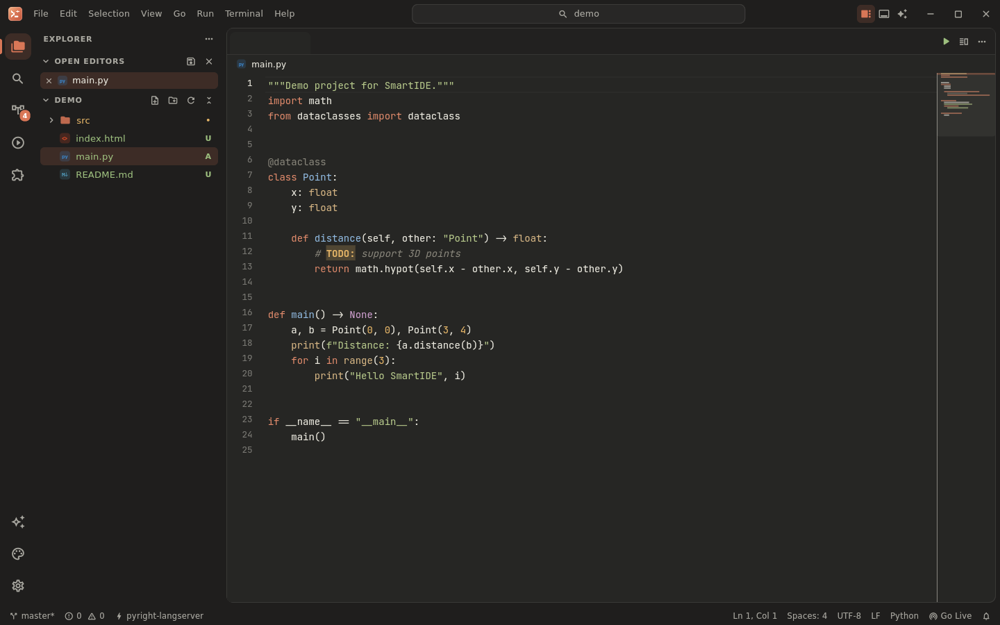
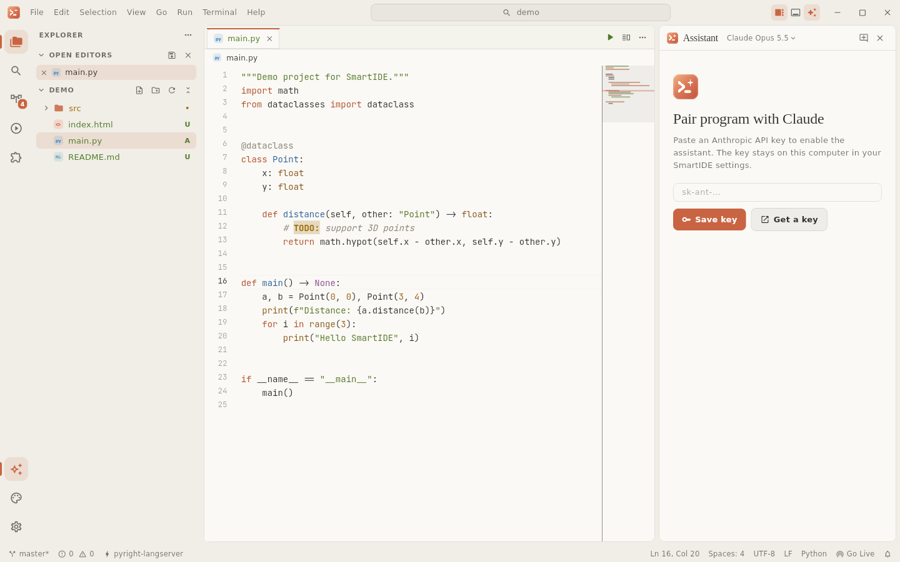
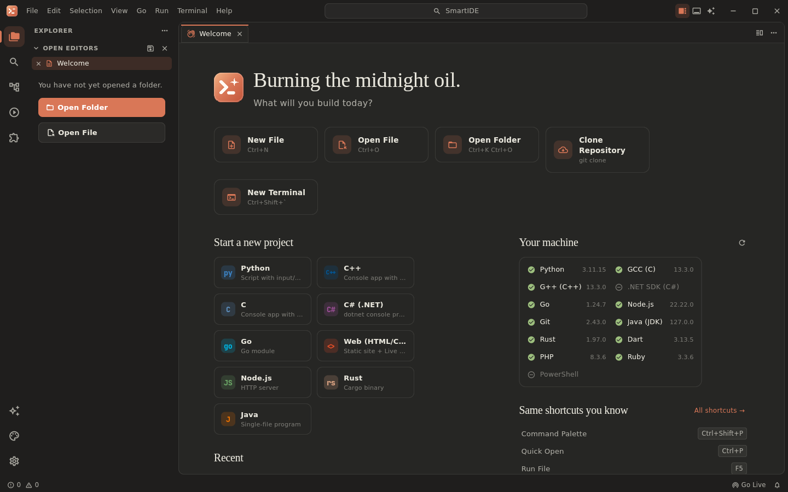
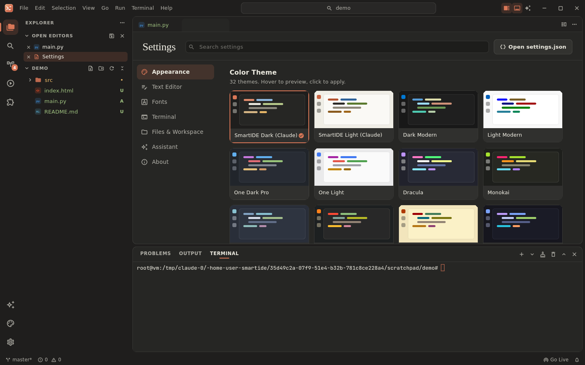
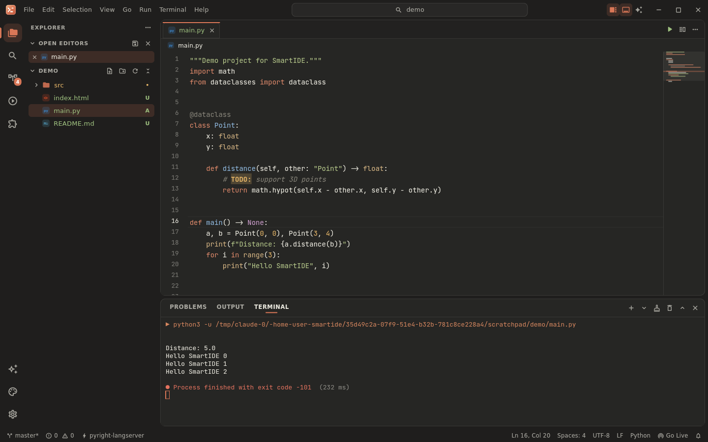
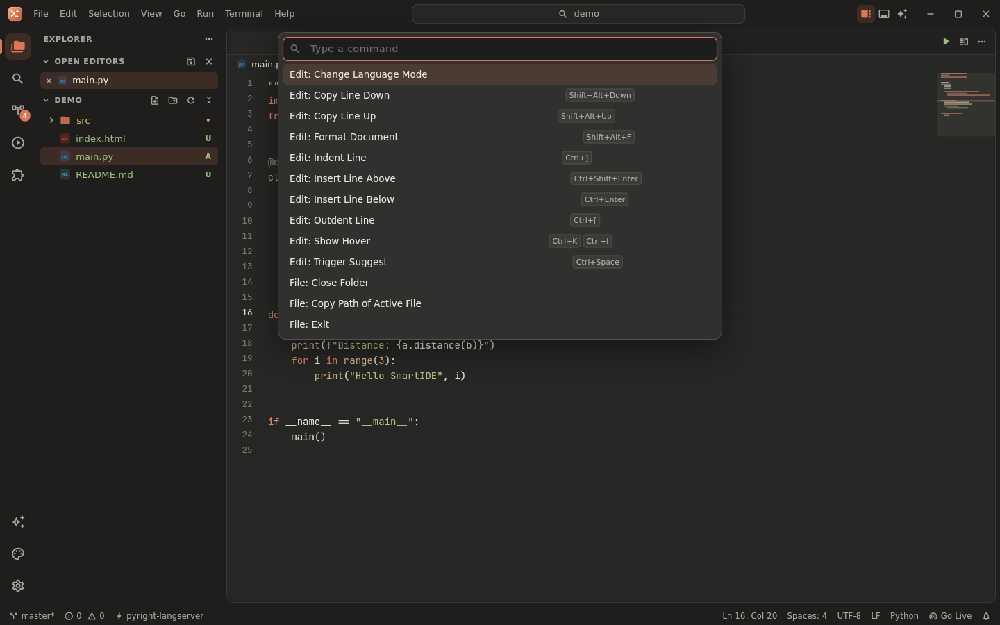
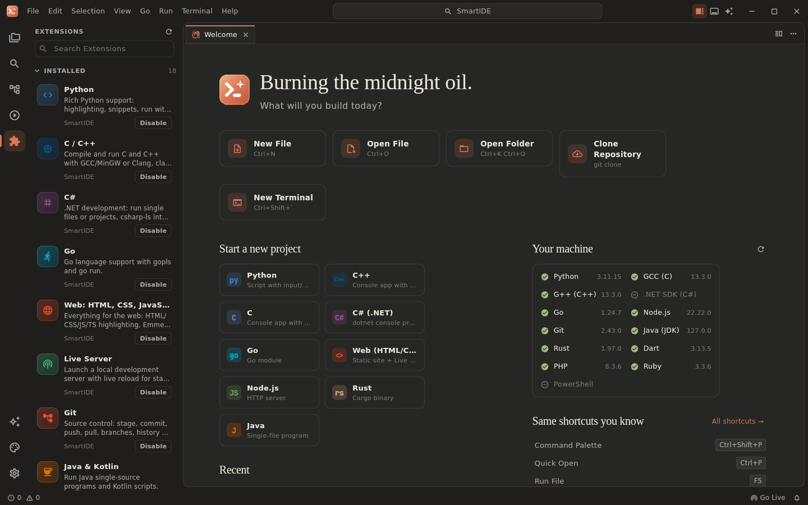

<p align="center">
  
</p>

<h1 align="center">SmartIDE</h1>

<p align="center">
  <b>Windows uchun tez, chiroyli va qulay kod muharriri.</b><br>
  Flutter'da yozilgan · VS Code tezkor tugmalari · Claude uslubidagi iliq dizayn
</p>

<p align="center">
  
</p>

---

## ✨ Imkoniyatlar

| | |
|---|---|
| 🧠 **Aqlli muharrir** | Sintaksis rangi (35+ til), avtomatik to'ldirish, snippet'lar, kodni yig'ish (folding), minimap, qidirish/almashtirish (regex), xato belgilari, TODO ta'kidlash |
| ⌨️ **VS Code tugmalari** | `Ctrl+P`, `Ctrl+Shift+P`, `Ctrl+B`, `` Ctrl+` ``, `Ctrl+D`, `Alt+↑/↓`, `Shift+Alt+↓`, `Ctrl+/`, `F5`, `Ctrl+K Ctrl+O` va boshqa 70+ yorliq. Hammasini qayta sozlasa bo'ladi |
| 🧩 **Kengaytmalar** | Python, C/C++, C#, Go, Web (HTML/CSS/JS/TS), Java & Kotlin, Rust, Dart, PHP, Ruby, PowerShell/Batch/Bash, Markdown, **Live Server**, **Git**, TODO Highlight, AI Assistant + onlayn katalog |
| ▶️ **Bir tugmada ishga tushirish** | `F5` faylni o'rnatilgan terminalda kompilyatsiya qiladi va ishga tushiradi (gcc/g++, dotnet, go, python, node, java, rustc/cargo...) |
| 🖥️ **Haqiqiy terminal** | ConPTY asosida: **PowerShell 7**, **Windows PowerShell**, **CMD**, **Git Bash**, **WSL** — avtomatik topiladi, bir nechta tab |
| 🌿 **Git** | Stage/unstage, commit, push/pull/sync, branch almashtirish, tarix, explorer'da rangli holatlar |
| 📡 **Live Server** | HTML'ni saqlashingiz bilan brauzer o'zi yangilanadi, CSS esa sahifani qayta yuklamasdan almashadi |
| 🎨 **32 ta tema** | SmartIDE Dark/Light (Claude), One Dark Pro, Dracula, Tokyo Night, Catppuccin ×4, Nord, Gruvbox, GitHub, Solarized, Rosé Pine, Kanagawa... + onlayn tema paketlari |
| 🔤 **25 ta shrift** | JetBrains Mono (ichida), Cascadia Code, Fira Code, Source Code Pro, IBM Plex Mono, Victor Mono, Geist Mono, Hack... — kerak bo'lganda yuklanadi |
| 💡 **IntelliSense (LSP)** | pyright, clangd, gopls, csharp-ls, rust-analyzer, typescript-language-server va boshqalar o'rnatilgan bo'lsa — avtomatik ulanadi: to'ldirish, xatolar, "Go to Definition", formatlash |
| 🤖 **AI yordamchi** | Claude bilan chat: faol fayl yoki belgilangan kodni kontekst sifatida yuboradi, javobdagi kodni bir bosishda muharrirga qo'yadi |
| 🖥️ **Kompyuterga moslashadi** | Python, GCC, .NET, Go, Node, Git, Java, Rust... o'rnatilganmi — o'zi tekshiradi, yo'q bo'lsa `winget` buyrug'ini taklif qiladi |
| 🚀 **Loyiha shablonlari** | Python, C++, C, C#, Go, Web, Node.js, Rust, Java — bir bosishda tayyor loyiha |

## 📸 Ko'rinishi

<table>
<tr>
<td></td>
<td></td>
</tr>
<tr>
<td></td>
<td></td>
</tr>
<tr>
<td></td>
<td></td>
</tr>
</table>

## 📦 O'rnatish

1. [**Releases**](https://github.com/ozodmeofficial/smartide/releases) (yoki **Actions → Build SmartIDE → Artifacts**) bo'limidan yuklab oling:
   - `SmartIDE-Setup-x.y.z-x64.exe` — **o'rnatuvchi** (tavsiya etiladi). Administrator huquqi kerak emas.
     O'rnatishda: ish stoli yorlig'i, Explorer'da **"Open with SmartIDE"** menyusi va terminalda `smartide .` buyrug'i.
   - `SmartIDE-x.y.z-portable-x64.zip` — o'rnatmasdan ishlatish uchun: oching va `SmartIDE.exe` ni ishga tushiring.
2. Birinchi ishga tushirishda SmartIDE kompyuteringizdagi kompilyator va dasturlarni o'zi topadi (**Run and Tools** paneli).

**Hajmi:** o'rnatuvchi LZMA2 bilan siqilgan (**~10.6 MB**; portable ZIP ~12 MB). Faqat JetBrains Mono shrifti ilova ichida keladi; qolgan shriftlar va qo'shimcha kengaytmalar kerak bo'lganda yuklanadi. Release build `--obfuscate`, `--split-debug-info` va ikonkalar tree-shaking bilan yig'iladi.

## ⌨️ Asosiy tezkor tugmalar

| Tugma | Amal | Tugma | Amal |
|---|---|---|---|
| `Ctrl+Shift+P` / `F1` | Buyruqlar paleti | `Ctrl+P` | Faylga o'tish (`:12` — qatorga, `>` — buyruqlar) |
| `Ctrl+B` | Yon panel | `Ctrl+J` | Pastki panel |
| `` Ctrl+` `` | Terminal | `` Ctrl+Shift+` `` | Yangi terminal |
| `F5` / `Ctrl+F5` | Faylni ishga tushirish | `Shift+F5` | To'xtatish |
| `Ctrl+Shift+B` | Build | `Alt+L Alt+O` | Live Server |
| `Ctrl+D` | Keyingi o'xshashini belgilash | `Ctrl+Shift+K` | Qatorni o'chirish |
| `Alt+↑/↓` | Qatorni ko'chirish | `Shift+Alt+↑/↓` | Qatorni nusxalash |
| `Ctrl+/` | Izoh | `Shift+Alt+F` | Formatlash |
| `Ctrl+F` / `Ctrl+H` | Qidirish / almashtirish | `Ctrl+Shift+F` | Fayllar bo'ylab qidirish |
| `F12` | Ta'rifga o'tish | `F8` | Keyingi xato |
| `Ctrl+\` | Muharrirni bo'lish | `Ctrl+K Ctrl+T` | Tema tanlash |
| `Ctrl+,` | Sozlamalar | `Ctrl+Alt+I` | AI yordamchi |
| `Ctrl+=` / `Ctrl+-` | Kattalashtirish | `Ctrl+K Z` | Zen rejim |

Barcha yorliqlar: **File → Preferences → Keyboard Shortcuts** (ikki marta bosib o'zgartiring). Sozlamalar `%APPDATA%\SmartIDE\` papkasida (`settings.json`, `keybindings.json` — VS Code formatida).

## 💡 IntelliSense uchun til serverlari (ixtiyoriy)

Sintaksis rangi, snippet'lar va so'zlar bo'yicha to'ldirish hech narsa o'rnatmasdan ishlaydi. Chuqur IntelliSense uchun:

| Til | O'rnatish |
|---|---|
| Python | `pip install pyright` |
| C / C++ | `winget install LLVM.LLVM` (clangd) |
| C# | `dotnet tool install --global csharp-ls` |
| Go | `go install golang.org/x/tools/gopls@latest` |
| JS / TS | `npm i -g typescript typescript-language-server` |
| HTML / CSS | `npm i -g vscode-langservers-extracted` |
| Rust | `rustup component add rust-analyzer` |

## 🛠️ Manba koddan yig'ish

```powershell
# Flutter 3.47+ va Visual Studio 2022 ("Desktop development with C++") kerak
git clone https://github.com/ozodmeofficial/smartide
cd smartide
flutter pub get
flutter run -d windows                      # ishlab chiqish rejimi
flutter build windows --release --obfuscate --split-debug-info=build/symbols
iscc installer\smartide.iss                 # o'rnatuvchi (Inno Setup 6)
```

Testlar: `flutter test test` · Tahlil: `flutter analyze`.

## 🧱 Arxitektura

```
lib/
├─ app/         Ide kontrolleri (buyruqlar, layout holati), quick pick
├─ core/        sozlamalar, tillar (35+), tezkor tugmalar, toolchain aniqlash, shablonlar
├─ services/    terminal (ConPTY), git, LSP mijoz, Live Server, qidiruv, kengaytmalar, AI
├─ theme/       32 tema (palitra → UI + sintaksis + terminal ranglari), shriftlar
├─ workspace/   fayl daraxti, hujjatlar, tablar, split guruhlar
└─ ui/          workbench, muharrir (re_editor), panellar, sahifalar
third_party/flutter_pty   Windows uchun tuzatilgan PTY (UTF-8 yo'llar, tez ochilish)
installer/                Inno Setup skripti
extensions/               onlayn kengaytmalar katalogi (tema va snippet paketlari)
```

## 🗺️ Keyingi rejalar

- Breakpoint'li debugger (DAP), ko'p kursorli tahrirlash
- Avtomatik yangilanish, sozlamalar sinxronizatsiyasi
- O'zbek / rus tilidagi interfeys

---

<details>
<summary><b>English</b></summary>

**SmartIDE** is a fast, good-looking code editor for Windows built with Flutter. It uses VS Code keyboard shortcuts and has a warm, Claude-inspired design. Features:

- Code editor with 35+ languages
- Integrated ConPTY terminal (PowerShell, CMD, Git Bash, WSL)
- Run the current file with F5
- Git panel and built-in Live Server
- LSP client (pyright, clangd, gopls, …)
- 32 themes and 25 coding fonts (downloaded on demand)
- Claude chat assistant (needs your own Anthropic API key)
- Online extension catalog

Downloads: an LZMA-compressed installer (per-user, adds an Explorer context menu and a PATH command) and a portable ZIP. Both are built by GitHub Actions.
</details>
